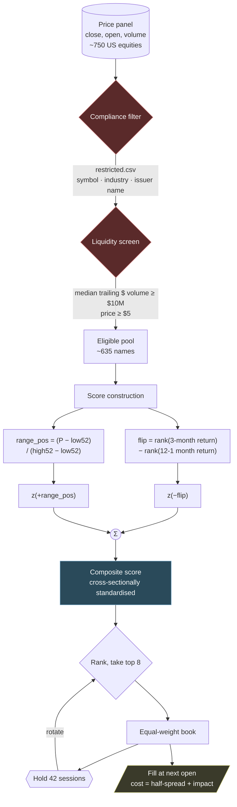
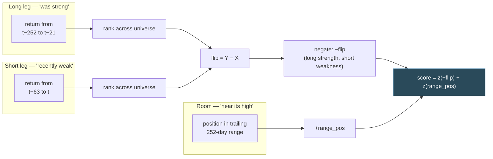

# Track J model — pullback-in-uptrend

> [!warning] Not live
> This documents a **candidate**. The live model is still the RSI/MA composite
> described in [[FINDINGS]]. The gate before go-live is the survivorship bound
> ([[TODO#0d. Delisting simulation — bound the survivorship exposure on the wide pool|TODO 0d]])
> plus items 1 and 2 of [[TODO#0h. Pre-production bug hypotheses for the Track J model — triage list|TODO 0h]].

## In one paragraph

Buy stocks with **strong twelve-month momentum that have recently pulled back**,
preferring those **near their 52-week high**, from a wide pool of liquid US
equities. Hold eight names, equal weight, rotating every 42 trading days. The
signal is deliberately *not* a trend-change detector — that was the original
hypothesis and it measured backwards (see [[FINDINGS]], Track J). What survived
is the inverse: long-run strength plus short-run weakness, which is classic 12-1
momentum combined with short-term reversal.

## Pipeline



## The score

Two terms, each cross-sectionally standardised before being combined so the
weights describe actual influence.



Written out:

$$
\text{flip} = \text{rank}(r_{63}) - \text{rank}(r_{252 \to 21})
\qquad
\text{range\_pos} = \frac{P - \min_{252} P}{\max_{252} P - \min_{252} P}
$$

$$
\text{score} = -w_{t}\, z(\text{flip}) \;+\; w_{r}\, z(\text{range\_pos})
$$

with $w_t = w_r = 1$ and $z(\cdot)$ the cross-sectional z-score.

### Why each piece is there

| term | reads | direction | evidence |
|---|---|---|---|
| `−flip` | strong 12-month momentum that has pulled back over 3 months | higher is better | ann. IR 0.4–1.0 across horizons; +16.19pp ranking skill gross |
| `range_pos` | how close the price is to its 52-week high | **higher is better** | positive IC at all six horizons on the wide pool |

> [!note] The 52-week term points the opposite way to intuition
> "Room to run" says distance *below* the high is headroom. The measurement says
> the opposite: **nearness** to the 52-week high predicts positively, which is
> the documented George & Hwang result. Weighting it as headroom makes the
> combined score significantly worse (t = −2.05 at 42 days).

> [!note] `range_pos` is worthless on the live 46-name universe
> On a universe curated for momentum, every name already sits near its high, so
> the term has no cross-sectional dispersion and adds noise. On 635 diverse names
> it carries real information. This is why the term looks harmful in the narrow
> test and is the best contributor in the wide one.

## Inputs

| input | source | notes |
|---|---|---|
| adjusted close, open | yfinance, `momentum/data.py` | open is required — fills are modelled at next open |
| daily volume | yfinance, `scripts/analyze_reversal_backtest.py::load_volume` | cached separately from `PriceData` |
| pool membership | `random_pool.csv` | 747 names, screener export; **uncurated** |
| restricted list | `restricted.csv` | applied by symbol, industry and issuer name |

## Parameters

Everything is configurable; nothing below is hard-coded at a call site.

### Score — `momentum/reversal.py::ReversalConfig`

| parameter | value | meaning |
|---|---|---|
| `long_window` | 252 | long leg lookback (~12 months) |
| `long_skip` | 21 | skip the most recent month from the long leg |
| `short_window` | 63 | short leg lookback (~3 months) |
| `room_window` | 252 | 52-week range window |
| `turn_weight` | −1.0 | applied to `flip`; negative is the whole finding |
| `strength_weight` | 0.0 | slope t-statistic — measured, carries nothing |
| `room_weight` | +1.0 | applied to `range_pos` |
| `normalization` | `cross_sectional` | z-score across names per date |

> [!info] These windows were never fitted
> 252/21/63 are literature conventions. They have not been tuned to this data,
> which is a property worth preserving — see [[TODO]] on why the sweep is a
> shape check and not an optimiser.

### Portfolio

| parameter | value | why |
|---|---|---|
| `top_n` | **8** | plateau, not peak: CAGR varies only 2.3pp across holds at 8, against 21.4pp at `top_n=2` |
| `hold_days` | **42** | flat region; cuts rebalances from 18/yr to 6/yr |
| sizing | equal weight | Track I found no scheme beats it |
| `vix` overlay | **off** | costs 3.4pp CAGR and 0.06 Sharpe on this score |
| correlation filter | inherited | ⚠️ untested at this book/pool size — [[TODO]] 0h.4 |
| `min_level_threshold` | inherited | ⚠️ still reads the old composite — [[TODO]] 0h.2 |

### Screens and costs

| parameter | value |
|---|---|
| min trailing median dollar volume | $10M |
| min price | $5 |
| execution | next open |
| cost model | `momentum/liquidity.py` — half-spread + square-root impact, point-in-time volume |
| assumed account | $100,000 |

## Measured performance

635 liquid, compliance-filtered names, realistic per-name costs, overlay off.

| arm | CAGR | Sharpe | Calmar | MaxDD | Vol |
|---|---|---|---|---|---|
| **this model** | **24.35%** | **0.65** | 0.43 | −56.5% | 30.5% |
| own the pool equal-weighted | 14.81% | 0.55 | 0.37 | −40.5% | 18.8% |
| random picks from same pool | 7.02% ±4.59 | 0.11 | 0.14 | −51.7% | 23.4% |
| live RSI/MA composite | 3.14% | −0.05 | 0.06 | −53.6% | 27.7% |

Ranking skill over its own random null, gross: **+16.52pp**, against **−3.44pp**
for the live composite. Across a 20-cell parameter grid it beats the live score
on CAGR in 95% of cells and on CAGR-and-Sharpe together in 80%.

> [!warning] Read the levels as inflated
> Survivorship is unquantified and this construction is maximally exposed to it —
> it buys dips, and the dips that were terminal are not in a pool built from
> today's survivors. Deltas between arms on the same pool are sound; the absolute
> 24% is not.

## What this model is not

- **Not a trend-change detector.** Both turn definitions predicted negatively at
  every horizon. That hypothesis is closed.
- **Not a drawdown manager.** The live model's main achievement is a −19% max
  drawdown; this one runs −56%. There is no exit rule yet ([[TODO]] 0g).
- **Not usable on the live 46-name universe.** The edge is absent above $50B
  market cap, which is where that universe sits.
- **Not validated out-of-sample.** Everything here is one history.

## Related

- [[FINDINGS]] — Track J stage one (the signal) and stage two (the backtest)
- [[TODO]] — 0d survivorship bound, 0e drawdown, 0f blending, 0g exits, 0h bugs
- [[RUNBOOK]] — operational procedure for the *live* model; does not yet cover this one

## Reproducing

```bash
python scripts/analyze_reversal_ic.py                                    # the signal
python scripts/analyze_reversal_backtest.py --pool screened --trials 15  # the portfolio
python scripts/analyze_reversal_backtest.py --pool screened --sweep      # the grid
python scripts/analyze_delisting_bound.py --top-n 8 --hold 42            # survivorship
```

Each script runs its validation gates first and exits non-zero without reporting
if any fails.
