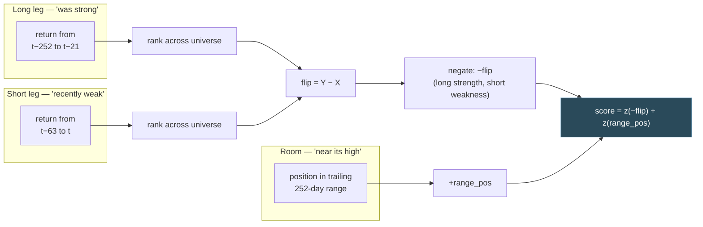

# Track J model — pullback-in-uptrend

**Selected score: `pullback`. Selected hold: 40 sessions (8 whole weeks).**

> [!warning] Not live
> This documents a **candidate**. The live model is still the RSI/MA composite
> described in [[FINDINGS]].
>
> Status 2026-09-20: the phase gate (TODO 0h.1) **passed** — the advantage holds
> at 100% of rotation phases. The level floor (0h.2) is **dropped**. The
> survivorship bound (0d) is **inconclusive and accepted as a known risk**.
> Score-switching (0f) is **closed — it does not work**.
>
> The out-of-sample window test is the reason this is still a candidate: against
> the live composite the advantage is **not statistically distinguishable**
> (t = 1.34), it wins only 17 of 30 six-month windows, and the two most recent
> full windows go heavily against it.

## In one paragraph

Buy stocks with **strong twelve-month momentum that have recently pulled back**,
preferring those **near their 52-week high**, from a wide pool of liquid US
equities. Hold eight names, equal weight, rotating every 40 trading days. The
signal is deliberately *not* a trend-change detector — that was the original
hypothesis and it measured backwards (see [[FINDINGS]], Track J). What survived
is the inverse: long-run strength plus short-run weakness, which is classic 12-1
momentum combined with short-term reversal.

## Pipeline


## The score

Two terms, each cross-sectionally standardised before being combined so the
weights describe actual influence.



Written out:

$$
\text{flip} = \text{rank}(r_{63}) - \text{rank}(r_{252 \to 21})
\qquad
\text{range\_pos} = \frac{P - \min_{252} P}{\max_{252} P - \min_{252} P}
$$

$$
\text{score} = -w_{t}\, z(\text{flip}) \;+\; w_{r}\, z(\text{range\_pos})
$$

with $w_t = w_r = 1$ and $z(\cdot)$ the cross-sectional z-score.

### Why each piece is there

| term | reads | direction | evidence |
|---|---|---|---|
| `−flip` | strong 12-month momentum that has pulled back over 3 months | higher is better | ann. IR 0.4–1.0 across horizons; +16.19pp ranking skill gross |
| `range_pos` | how close the price is to its 52-week high | **higher is better** | positive IC at all six horizons on the wide pool |

> [!note] The 52-week term points the opposite way to intuition
> "Room to run" says distance *below* the high is headroom. The measurement says
> the opposite: **nearness** to the 52-week high predicts positively, which is
> the documented George & Hwang result. Weighting it as headroom makes the
> combined score significantly worse (t = −2.05 at 42 days).

> [!note] `range_pos` is worthless on the live 46-name universe
> On a universe curated for momentum, every name already sits near its high, so
> the term has no cross-sectional dispersion and adds noise. On 635 diverse names
> it carries real information. This is why the term looks harmful in the narrow
> test and is the best contributor in the wide one.

## Inputs

| input | source | notes |
|---|---|---|
| adjusted close, open | yfinance, `momentum/data.py` | open is required — fills are modelled at next open |
| daily volume | yfinance, `scripts/analyze_reversal_backtest.py::load_volume` | cached separately from `PriceData` |
| pool membership | `random_pool.csv` | 747 names, screener export; **uncurated** |
| restricted list | `restricted.csv` | applied by symbol, industry and issuer name |

## Parameters

Everything is configurable; nothing below is hard-coded at a call site.

### Score — `momentum/reversal.py::ReversalConfig`

| parameter | value | meaning |
|---|---|---|
| `long_window` | 252 | long leg lookback (~12 months) |
| `long_skip` | 21 | skip the most recent month from the long leg |
| `short_window` | 63 | short leg lookback (~3 months) |
| `room_window` | 252 | 52-week range window |
| `turn_weight` | −1.0 | applied to `flip`; negative is the whole finding |
| `strength_weight` | 0.0 | slope t-statistic — measured, carries nothing |
| `room_weight` | +1.0 | applied to `range_pos` |
| `normalization` | `cross_sectional` | z-score across names per date |

> [!info] These windows were never fitted
> 252/21/63 are literature conventions. They have not been tuned to this data,
> which is a property worth preserving — see [[TODO]] on why the sweep is a
> shape check and not an optimiser.

### Portfolio

| parameter | value | why |
|---|---|---|
| `top_n` | **8** | plateau, not peak: CAGR varies only 2.3pp across holds at 8, against 21.4pp at `top_n=2` |
| `hold_days` | **40** | exactly 8 weeks, so the rebalance lands on a fixed, schedulable weekday instead of drifting two weekdays per cycle. Verified against 42: `pullback` moves 21.46% -> 20.93% CAGR, inside noise. |
| sizing | equal weight | Track I found no scheme beats it |
| `vix` overlay | **off** | costs 3.4pp CAGR and 0.06 Sharpe on this score |
| correlation filter | **absolute 0.70, EVERY rebalance** | swept 0.60-0.80; 0.70 is a ridge, not a spike. +2.72pp CAGR, Sharpe 0.64 -> 0.78, turnover unchanged. Replaces the inherited relative-percentile rule gated at VIX>25, which left no diversification constraint in a normal regime. |
| `min_level_threshold` | **dropped** | it read the OLD composite's scores; gating a new score on one we have no reason to trust is incoherent. Stage one measured it as near-inert (650.5 vs 652.2 eligible names). |

### Screens and costs

| parameter | value | notes |
|---|---|---|
| min trailing dollar volume | $10M | **per date**, not full-sample |
| min price | $5 | proxy for the exchange continued-listing minimum |
| execution | next open | |
| cost model | `momentum/liquidity.py` — half-spread + square-root impact | point-in-time volume |
| assumed account | $100,000 | order size = account / `top_n` |

> [!important] The screen is applied per date, and that matters
> An earlier version selected pool membership from each name's **full-sample**
> median dollar volume. That is look-ahead — a name earned its place in the 2010
> cross-section because of volume it had in 2020 — and it quietly reintroduces
> survivorship, since the names that stayed liquid are the ones that did well.
> `liquidity.tradable_mask` now blanks the score on days a name fails either
> floor, so it becomes unpickable and pickable again as conditions change.
>
> The price floor is also the delisting mitigation: the bound found that 37% of
> cause-based delistings stop being tradable a median **95-100 sessions** before
> they die.

## Measured performance

Per-date screened pool, compliance-filtered, per-name point-in-time costs,
overlay off, `top_n=8`, `hold=42`.

| arm | CAGR | Sharpe | Calmar | MaxDD | Vol |
|---|---|---|---|---|---|
| **`flip_neg`** | **26.56%** | **0.69** | 0.51 | −52.6% | 32.0% |
| `pullback` (+`range_pos`) | 21.46% | 0.66 | 0.46 | −46.8% | 25.8% |
| live RSI/MA composite | 14.36% | 0.46 | 0.49 | −29.3% | 21.6% |
| own the pool equal-weighted | 13.48% | 0.48 | 0.33 | −40.5% | 18.7% |
| random picks from same pool | 11.92% ±2.89 | 0.36 | 0.29 | −42.8% | 20.6% |

Ranking skill over its own random null, gross: **+14.84pp** for `flip_neg`,
+9.48pp for `pullback`, **+2.49pp** for the live composite. Across a 20-cell
`top_n` × `hold` grid the new score beats live on CAGR in **95%** of cells and
on CAGR-and-Sharpe together in **80%**.

> [!warning] Quote the median, not the headline — phase is worth 10pp
> The table above is **one rotation phase**. Across 14 sampled offsets the new
> score's CAGR spans **13.16% to 23.35%**, a 10.19pp spread, against 0.71pp for
> equal weight — so the dispersion is a rotation artifact, not the data. The
> honest point estimate is the **median 21.56%**, and the 26.56% above is a
> favourable draw. In live trading you get exactly one phase and cannot know in
> advance which. See [[TODO]] 0i for the two ways to stop taking that bet.
>
> What *does* survive phase: the new score beats live at **100%** of sampled
> phases and equal weight at 93%, worst phase still +1.00pp.

### Out of sample, by 6-month window

> [!success] The correlation rule changed the verdict
> Before the absolute-0.70 filter, nothing cleared |t| = 2 against the live
> composite. With it, all four comparisons do, and `flip_neg` beats live in
> **21 of 30** calendar windows rather than 17.
>
> | challenger | vs | win rate | median | t before | t after |
> |---|---|---|---|---|---|
> | `flip_neg` | live | 68% | +5.54% | 1.34 | **2.61** |
> | `pullback` | live | 61% | +3.86% | 1.62 | **2.79** |
> | `flip_neg` | equal weight | 59% | +2.63% | 2.13 | 2.59 |
> | `pullback` | equal weight | 56% | +3.36% | 2.86 | 2.75 |
>
> The t-statistics remain optimistic because windows are pooled across phases.
> Win rate and worst window do not have that problem.

### The pre-filter measurement, kept for the record

Neither score has a parameter fitted on this data, so splitting the record into
windows leaks nothing. 95 windows pooled across 3 rotation phases:

| challenger | vs | win rate | median excess | t | worst window |
|---|---|---|---|---|---|
| `flip_neg` | live | 62% | +6.60% | **1.34** | −73.4% |
| `flip_neg` | equal weight | 57% | +3.03% | 2.13 | −27.2% |
| `pullback` | live | 64% | +5.21% | **1.62** | −53.1% |
| `pullback` | equal weight | 56% | +2.58% | 2.86 | −22.4% |

> [!danger] Against the live composite this is not statistically distinguishable
> t = 1.34, and that figure is already **optimistic** because windows are pooled
> across phases. It beat live in **17 of 30** calendar windows — a tilted coin.
> The full-sample CAGR gap comes from a minority of windows winning big, not
> from consistent superiority.
>
> **The two most recent full windows go heavily against it**: 2025-07 (live
> +22.0% vs −7.6%) and 2026-01 (live +51.1% vs −0.2%). The live composite has
> been strong lately.
>
> What survives: it beats *owning the pool* at t = 2.13 / 2.86, which is the
> comparison Track F identified as the one that matters.

> [!warning] Read the levels as inflated
> Survivorship is unquantified and this construction is maximally exposed to it —
> it buys dips, and the dips that were terminal are not in a pool built from
> today's survivors. The bound (TODO 0d) was inconclusive and is accepted as a
> known risk. Deltas between arms on the same pool are sound; the absolute level
> is not.

## What this model is not

- **Not a trend-change detector.** Both turn definitions predicted negatively at
  every horizon. That hypothesis is closed.
- **Not a drawdown manager.** The live model's main achievement is a −19% max
  drawdown; this one runs −56%. There is no exit rule yet ([[TODO]] 0g).
- **Not usable on the live 46-name universe.** The edge is absent above $50B
  market cap, which is where that universe sits.
- **Not validated out-of-sample.** Everything here is one history.

## Open decisions before this could go live

| | |
|---|---|
| ~~`hold=40`~~ | **Decided 2026-09-20.** 8 whole weeks, fixed rebalance weekday. Verified: `pullback` 21.46% -> 20.93%, inside noise. |
| ~~which score~~ | **Decided: `pullback`.** See below. |
| allocation size | **Open.** The out-of-sample result (t = 1.34 against live) argues for a partial allocation rather than a wholesale switch. |
| ~~correlation filter~~ | **Decided: absolute 0.70, every rebalance.** Superseded the earlier "keep the inherited gating" decision once the absolute rule was tested — the two are different rules and the first test conflated them. |

### Why `pullback` rather than `flip_neg`

`flip_neg` leads on headline CAGR at one configuration. `pullback` wins on
everything that speaks to whether the number will repeat:

| | `flip_neg` | `pullback` |
|---|---|---|
| CAGR at `hold=42` | 26.56% | 21.46% |
| CAGR at `hold=40` | **19.11%** | **20.93%** |
| Sharpe at `hold=40` | 0.47 | **0.64** |
| Calmar at `hold=40` | 0.38 | **0.50** |
| out-of-sample win rate vs live | 62% | **64%** |
| CAGR with best 1% of days removed | 3.35% | **5.68%** |
| max drawdown | −50.0% | **−41.8%** |

A two-session change in hold costs `flip_neg` 7.5pp of CAGR and 0.22 of Sharpe.
`pullback` moves half a point. Three independent measures — hold sensitivity,
out-of-sample consistency, outlier dependence — all favour the same one, and
the headline-CAGR advantage of `flip_neg` does not survive any of them.

## Related

- [[FINDINGS]] — Track J stage one (the signal) and stage two (the backtest)
- [[TODO]] — 0d survivorship bound, 0e drawdown, 0f blending, 0g exits, 0h bugs
- [[RUNBOOK]] — operational procedure for the *live* model; does not yet cover this one

## Reproducing

```bash
# the signal
python scripts/analyze_reversal_ic.py
# the portfolio, at the chosen configuration
python scripts/analyze_reversal_backtest.py --pool screened --trials 15 --top-n 8 --hold 42
# the parameter grid (shape check, not an optimiser)
python scripts/analyze_reversal_backtest.py --pool screened --sweep
# rotation phase — the production gate, TODO 0h.1
python scripts/analyze_rotation_phase.py --hold 42 --top-n 8
# out of sample by window, and score-switching (TODO 0f)
python scripts/analyze_walkforward_scores.py --top-n 8 --hold 42 --phases 3
# survivorship bound (TODO 0d) — inconclusive, kept for the record
python scripts/analyze_delisting_bound.py --top-n 8 --hold 42
```

Each script runs its validation gates first and exits non-zero without reporting
if any fails.
